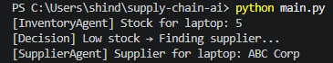

\# Multi-Agent Supply Chain Automation System

\## Overview

This project simulates a multi-agent AI system designed to automate basic supply chain workflows such as inventory monitoring and supplier selection.

\## Features

\- Inventory Agent to track product stock levels

\- Supplier Agent to identify suitable vendors

\- Decision-based workflow for automated actions

\- Modular design for easy extension

\## Tech Stack

\- Python

\- Environment Variables (.env)

\## Workflow

1\. Inventory Agent checks stock levels

2\. If stock is low, Supplier Agent is triggered

3\. System outputs supplier recommendation

\## Future Improvements

\- Integrate LLM-based agents (CrewAI / LangChain)

\- Add Retrieval-Augmented Generation (RAG)

\- Deploy as API using FastAPI

## Demo Output

